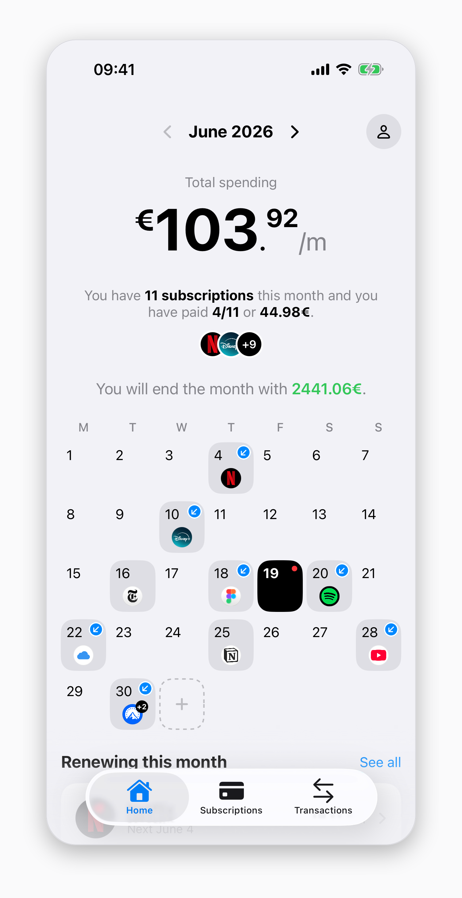
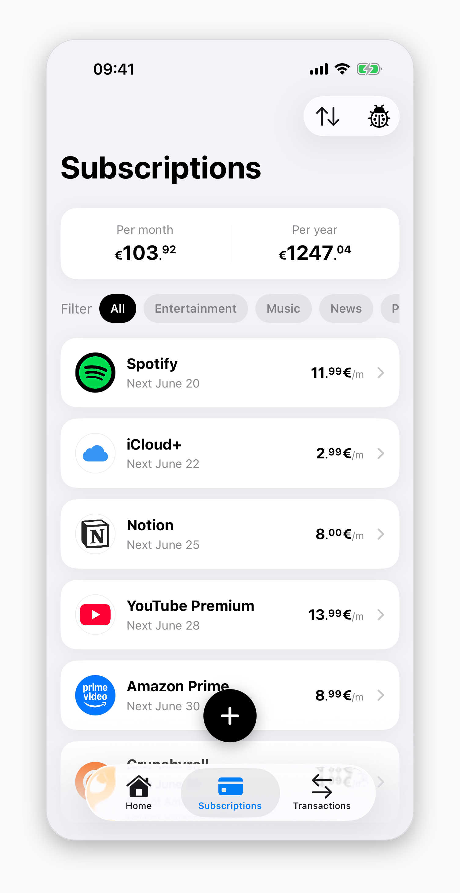
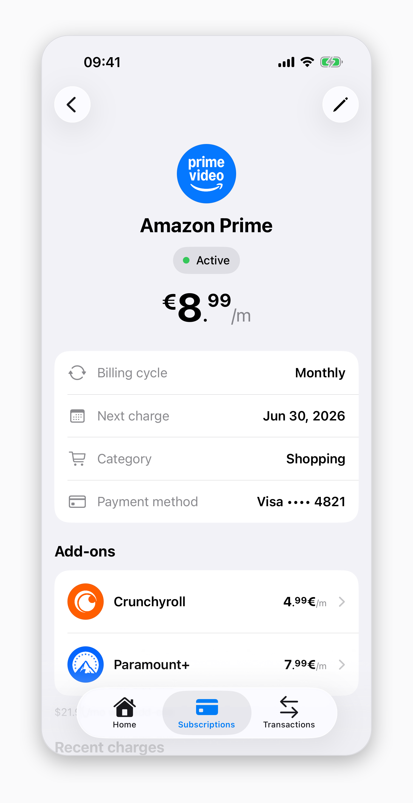

# Cadence

> A native iOS subscription tracker that keeps recurring spending and month-end balance projections in view.

[](LICENSE)
[](https://github.com/jmartinn/cadence/actions/workflows/ci.yml)




Cadence helps keep subscription renewals, run-rate totals, and the current month-end outlook in one place. The app is focused today on subscriptions and forecasting, with local-first persistence on device.

## Features

- Track recurring subscriptions with monthly or yearly billing schedules.
- See monthly and yearly run-rate totals.
- Anchor the current balance, optional monthly income, and payday to project the end-of-month balance.
- Browse a monthly renewal calendar and jump into subscription details from calendar markers.
- Add, edit, pause, resume, cancel, reactivate, and delete subscriptions.
- Categorize subscriptions and filter the Subscriptions tab by populated categories.
- Link subscriptions as display-only add-ons while keeping forecast totals accurate.
- Pick from a curated service catalog with bundled app icons and graceful monogram fallbacks.
- Keep data local-first with SwiftData; CloudKit sync is deferred.

## Screenshots

| Subscriptions | Details |
| --- | --- |
|  |  |

## Architecture & Engineering

- SwiftUI iOS app built on the MV (Model–View) pattern — no view-models — using `@Query`, `@State`, and `@Bindable`, with pure presenter structs for list and derivation logic.
- SwiftData persistence through local models in `Cadence/Persistence/`.
- Pure domain logic in the `CadenceKit` SwiftPM package.
- `BillingSchedule` computes recurring charge dates from anchors and cycles.
- `Forecaster` projects balances from a continuous balance anchor using half-open windows and `Decimal` money.
- Subscription charges are computed, not persisted as transactions.
- Unit coverage spans `CadenceTests` and `CadenceKit/Tests/CadenceKitTests`; UI tests are scaffolded in `CadenceUITests`.
- GitHub Actions runs `domain`, `verify`, and `commit-lint`.

## Getting Started

- Install Xcode with the iOS 26.5 SDK.
- Open `Cadence.xcodeproj`.
- Run the `Cadence` scheme.
- A physical iPhone is preferred for local development; the iPhone 17 simulator is usable for compile and test checks.
- Activate the tracked hooks once per clone:

```bash
git config core.hooksPath .githooks
git config commit.template .gitmessage
```

## Project Structure

```text
Cadence/          SwiftUI app, persistence, feature screens, reusable components
CadenceKit/       Pure domain package and domain tests
CadenceTests/     App unit tests
CadenceUITests/   XCTest UI-test scaffold
.github/          CI workflows and repository templates
```

## Contributing

See [Contributing](CONTRIBUTING.md) for setup and pull request guidance, and [Code of Conduct](CODE_OF_CONDUCT.md) for participation expectations.

## License

Cadence is available under the [MIT License](LICENSE).
